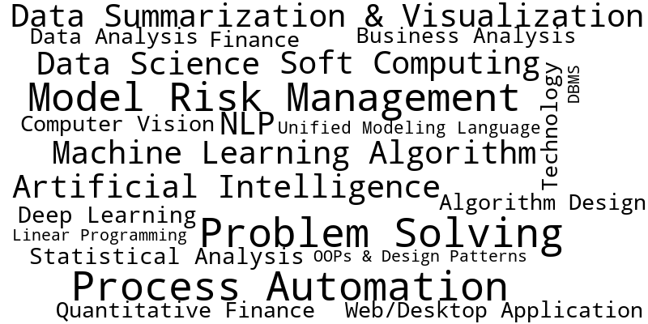

## Hi there 👋

### Areas of Focus ☁️

<h3> 👨‍💻 Languages I use</h3>

<!--START_SECTION:colourise-->

<!--END_SECTION:colourise-->

  

- 🔭 I’m currently working on [here](https://github.com/Rikan-Saha/Front-End-Mentor)...
- 🌱 I’m currently learning ...
- 👯 I’m looking to collaborate on ...
- 🤔 I’m looking for help with ...
- 💬 Ask me about ...
- 📫 How to reach me: ...
- 😄 Pronouns: ...
- ⚡ Fun fact: ...
- 

